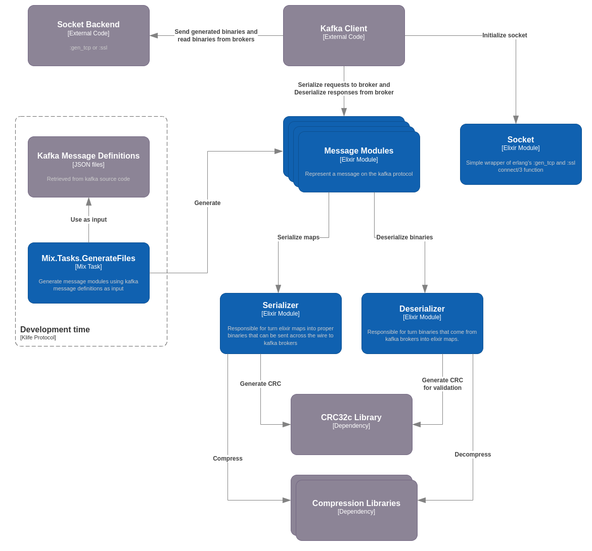

# Klife Protocol

This is an Elixir implementation of the [Kafka protocol](https://kafka.apache.org/protocol.html). It enables communication with Kafka brokers using standard Elixir data structures without the need for manual serialization.

The implementation is specifically designed to handle only the wire protocol. Therefore, it should be used inside a full Kafka client rather than being directly integrated into application code.

## Supported messages

One of the main features of this library is its ability to generate Elixir code using [Kafka message definitions](https://github.com/apache/kafka/tree/trunk/clients/src/main/resources/common/message). This ensures that all currently available and future messages (excluding the ones mentioned below) should be easily supported in all versions by the implementation. 

This implementation of the Kafka protocol supports all currently available messages and versions, except for `Fetch` versions below 4. This is due to a change in record batch serialization in newer versions (>=4) of this message. As a result, the library is NOT compatible with Kafka versions prior 0.11.

## Basic example

This is an example of usage that creates a connection with a broker, send the API version message and handle the response.

```elixir
alias KlifeProtocol.Socket
alias KlifeProtocol.Messages


{:ok, socket} = Socket.connect("localhost", 19092, [backend: :gen_tcp, active: false])
version = 0
input = %{headers: %{correlation_id: 123}, content: %{}}
serialized_msg = Messages.ApiVersions.serialize_request(input, version)
:ok = :gen_tcp.send(socket, serialized_msg)
{:ok, received_data} = :gen_tcp.recv(socket, 0, 5_000)
{:ok, response} = Messages.ApiVersions.deserialize_response(received_data, version)
```

Inside the `response` variable you will get something like this:

```elixir
%{
  content: %{
    api_keys: [
      %{api_key: 0, max_version: 9, min_version: 0},
      %{api_key: 1, max_version: 13, min_version: 0},
      %{api_key: 2, max_version: 7, min_version: 0},
      %{api_key: 3, max_version: 12, min_version: 0},
      ...
    ],
    error_code: 0,
    throttle_time_ms: 0
  },
  headers: %{correlation_id: 123}
}
```
## Messages API

Each message has it's own set of fields, as described in the Kafka official documentation. On this library, each message has it's own module within `KlifeProtocol.Messages` namespace. In the previous example we used `KlifeProtocol.Messages.ApiVersions` which stands for the [API version message](https://kafka.apache.org/protocol.html#The_Messages_ApiVersions).

Each message contains 2 main functions:

- `serialize_request/2`: Receives a map and serialize it to kafka wire format of the given version.
- `deserialize_response/3`: Receive a binary in the kafka wire format and deserialize it into a map.

You can find the available fields directly on the Kafka documentation or inside the message module documentation which contains all the possible fields, along with extra comments describing each one of them. All fields can be provided (for serialization) or returned (for deseriaization) inside the content map attribute.

### Serialize Request

It expects a map containing 2 attributes `headers` and `content` that are also maps. The required fields of each map depends on the version being handled and can be found on the documentation.

It returns the binary in the kafka's wire format.

For instance the `Messages.ApiVersions.serialize_request/2` has the following documentation:

```elixir
  @doc """
  Content fields:

  - client_software_name: The name of the client. (string | versions 3+)
  - client_software_version: The version of the client. (string | versions 3+)
  """
```

Which means that on versions 3+ you can provide `client_software_name` and `client_software_version` on the content map of the input, like this:

```elixir
input = %{headers: %{correlation_id: 123}, content: %{client_software_name: "some_name"}}
serialized_msg = Messages.ApiVersions.serialize_request(input, 3)
```

### Deserialize Response

It expects the binary, version and a boolean indicating if the given binary contains the header or not (defaults to true, meaning that the header data is expected to be present).

It returns a tuple `{:ok, map}` and the map always have the `content` attribute and may have the `headers` attribute depending on the `with_header?` boolean of the input.

The possible content fields are describe the same way of the serialization process.

For instance the `Messages.ApiVersions.deserialize_response/3` has the following documentation:

```elixir
  @doc """
  Content fields:

  - error_code: The top-level error code. (int16 | versions 0+)
  - api_keys: The APIs supported by the broker. ([]ApiVersion | versions 0+)
      - api_key: The API index. (int16 | versions 0+)
      - min_version: The minimum supported version, inclusive. (int16 | versions 0+)
      - max_version: The maximum supported version, inclusive. (int16 | versions 0+)
  - throttle_time_ms: The duration in milliseconds for which the request was throttled due to a quota violation, or zero if the request did not violate any quota. (int32 | versions 1+)
  - supported_features: Features supported by the broker. ([]SupportedFeatureKey | versions 3+)
      - name: The name of the feature. (string | versions 3+)
      - min_version: The minimum supported version for the feature. (int16 | versions 3+)
      - max_version: The maximum supported version for the feature. (int16 | versions 3+)
  - finalized_features_epoch: The monotonically increasing epoch for the finalized features information. Valid values are >= 0. A value of -1 is special and represents unknown epoch. (int64 | versions 3+)
  - finalized_features: List of cluster-wide finalized features. The information is valid only if FinalizedFeaturesEpoch >= 0. ([]FinalizedFeatureKey | versions 3+)
      - name: The name of the feature. (string | versions 3+)
      - max_version_level: The cluster-wide finalized max version level for the feature. (int16 | versions 3+)
      - min_version_level: The cluster-wide finalized min version level for the feature. (int16 | versions 3+)
  - zk_migration_ready: Set by a KRaft controller if the required configurations for ZK migration are present (bool | versions 3+)
  """
```

```elixir
{:ok, %{ headers: headers, content: content }} = Messages.ApiVersions.deserialize_response(binary, 3)

%{
  error_code: 0,
  api_keys: api_keys,
  throttle_time_ms: 0,
  finalized_features_epoch: 0
} = content

```

### Headerless deserialization

If for some reason you need to take a peek at the message header before fully deserialize it you can use the `KlifeProtocol.Header.deserialize_response/2` function.

It expects a binary and version, returning the header map and the remaning binary. But notice that the header version is different from the message version.

```elixir
alias KlifeProtocol.Socket
alias KlifeProtocol.Messages

{:ok, socket} = Socket.connect("localhost", 19092, [backend: :gen_tcp, active: false])
version = 0
input = %{headers: %{correlation_id: 123}, content: %{}}
serialized_msg = Messages.ApiVersions.serialize_request(input, version)
:ok = :gen_tcp.send(socket, serialized_msg)
{:ok, received_data} = :gen_tcp.recv(socket, 0, 5_000)
{:ok, {headers_map, rest_data}} =  KlifeProtocol.Header.deserialize_response(received_data, 0)
```

After, you can use the `deserialize_response/3` function of the messages API, passing false on the third argument to prevent header deserailization again and deserialize the remaing of the binary.

```elixir
{:ok, %{content: content}} = Messages.ApiVersions.deserialize_response(rest_data, version, false)
```


## Compression and Record Batch Attributes

Currently supports two compression methods: `snappy` using [sanppyer library](https://github.com/zmstone/snappyer) and `gzip` using [erlang zlib library](https://www.erlang.org/doc/man/zlib.html).


To configure the compression strategy, along with other important data such as `timestampType` and `isTransactional`, you can utilize the Kafka record batch's [attributes byte](https://kafka.apache.org/documentation/#recordbatch).


Klife protocol provides an interface to simplify the creation of this attributes using the `encode_attributes/1` and `decode_attributes/1` functions of the `RecordBatch` module. Here's an example:

```elixir
alias KlifeProtocol.RecordBatch

opts = [
  compression: :snappy, 
  timestamp_type: :log_append_time,
  is_transactional: true,
  is_control_batch: true,
  has_delete_horizon: true
]

attr_val = RecordBatch.encode_attributes(opts)

%{
  compression: :snappy,
  timestamp_type: :log_append_time,
  is_transactional: true,
  is_control_batch: true,
  has_delete_horizon: true
} = RecordBatch.decode_attributes(attr_val)
```

With these functions, a client can easily generate and decode attributes for each record batch it handles.
## Performance

This section provides performance benchmarks for the main use cases of produce serialization and fetch deserialization, conducted using the [benchee tool](https://github.com/bencheeorg/benchee). The benchmarks measure only the serialization work, as the Kafka cluster is running solely to retrieve data samples for benchmarking purposes. Note that network latency is not included in the measurements, only serialization/deserialization performance.

The benchmarks were conducted on a personal computer with the following specifications, using only a single core. The operations were performed on messages containing a single record batch with 1, 10, 50 and 100 records to/from a single partition without compression.

```
CPU: AMD Ryzen 7 5700U
Elixir: 1.15.7-OTP-26
Erlang: 26.1
OS : Debian 12
Kernel: 6.1.0-13-amd64 (64-bit)
```

All benchmarks can be executed by running the benchmark mix task from the project's base folder:
```
bash run-kafka.sh
mix benchmark produce_serialization
mix benchmark fetch_deserialization
bash stop-kafka.sh
```
### Produce Serialization
| REC QTY | REC SIZE | REC/S   | IPS    | AVG    | P50    | P99     | SD    | Mem. Usg |
|---------|----------|---------|--------|--------|--------|---------|-------|----------|
| 1       | 500 kb   | 3.92 k  | 3.92 K | 254 μs | 252 μs | 300 μs  | ±4.8% | 3 kb     |
| 10      | 50 kb    | 37.6 k  | 3.76 K | 265 μs | 263 μs | 316 μs  | ±4.4% | 12 kb    |
| 50      | 10 kb    | 146.6 k | 2.93 K | 341 μs | 340 μs | 393 μs  | ±4.6% | 52 kb    |
| 100     | 5 kb     | 246.0 k | 2.46 K | 406 μs | 399 μs | 520 μs  | ±7.5% | 94 kb    |

### Fetch Deserialization
| REC QTY | REC SIZE | REC/S  | IPS    | AVG    | P50    | P99     | SD   | Mem. Usg |
|---------|----------|--------|--------|--------|--------|---------|------|----------|
| 1       | 500 kb   | 4.23 k | 4.23 k | 236 μs | 224 μs | 400 μs  | ±14% | 22 kb    |
| 10      | 50 kb    | 36.2 k | 3.62 k | 276 μs | 257 μs | 421 μs  | ±17% | 69 kb    |
| 50      | 10 kb    | 116 k  | 2.32 k | 430 μs | 419 μs | 558 μs  | ±13% | 281 kb   |
| 100     | 5 kb     | 170 k  | 1.70 k | 587 μs | 580 μs | 772 μs  | ±13% | 545 kb   |


## Project Overview

The project is composed by 5 main components:

- Module generator: This component performs a variety of tasks to convert Kafka's message definitions into message modules.

- Message Modules: These modules serve as the primary interface for clients using this library. They enable the serialization and deserialization of specific messages in the Kafka protocol.

- Serializer: This module is responsible for transforming Elixir maps into appropriate binaries using the schemas defined by the message modules. These binaries can then be sent across the wire to Kafka brokers.

- Deserializer: This module handles the conversion of binaries received from Kafka brokers into Elixir maps. It utilizes the schemas defined by the message modules.

- Socket: Simple wrapper of `:gen_tcp` and `:ssl` `connect/3` function that set socket opts that are needed to proper communicate with kafka broker `packet: 4` and `binary`. It is intended to be used only for the socket initialization, all other operations must be done using `:gen_tcp` or `:ssl` directly.


## Running Tests

```
bash run-kafka.sh
mix test
bash stop-kafka.sh
```

In order to prevent race conditions with kafka initialization is recommended to wait a couple seconds between `bash run-kafka.sh` and `mix test`. 

If you want to run tests using a SSL connection, you can use an env var `CONN_MODE=SSL` like this:

```
bash run-kafka.sh
CONN_MODE=SSL mix test
bash stop-kafka.sh
```